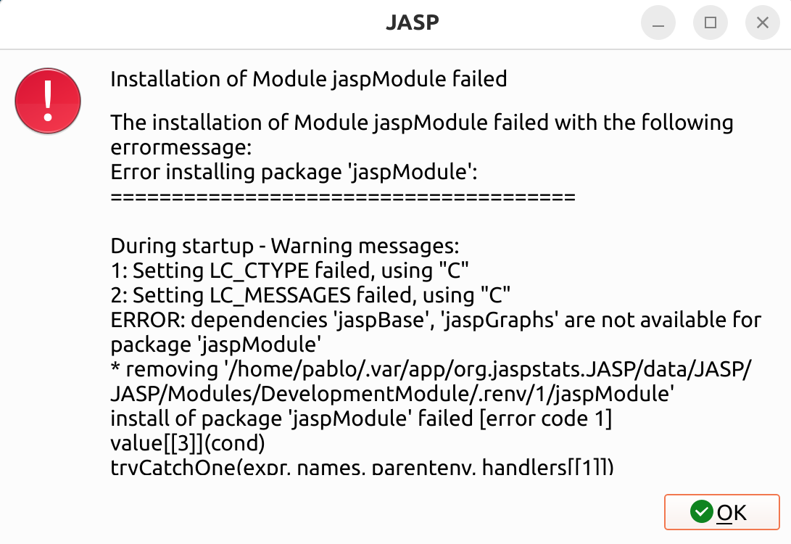

# Developing workflow in JASP for modules
So you want to develop a module for JASP? Great!

## Step 1. Install a latest version of JASP

### Windows & macOs
The easiest way to do so is downloading the latest [nightly for your system](http://static.jasp-stats.org/Nightlies/).

### Linux

0. Installing JASP in Linux requires flatpak. Please follow [this link](https://flatpak.org/setup/) if you haven't installed it yet.
1. Add the `flathub-beta` repository with: 

```sh
flatpak remote-add --if-not-exists flathub-beta https://flathub.org/beta-repo/flathub-beta.flatpakrepo
```

3. Install the latest jasp beta with:

```sh
flatpak install flathub-beta org.jaspstats.JASP
```

4. Open it in development mode:

```sh
flatpak run --branch=beta --devel org.jaspstats.JASP
```

> [!WARNING]
> JASP will remember from which branch it was launched.
> To go back to the "normal" jasp, run: 
> ```sh
> flatpak run --branch=stable org.jaspstats.JASP
> ```

#### Problems?
Some users experienced the following error:
```sh
error: runtime/org.kde.Sdk/x86_64/6.7 not installed
```
This can be fixed by manually installing the missing runtime:
```sh
flatpak install org.kde.Sdk
```
and choosing the appropriate version (`6.7` in this example).

### From source (advanced)
In case you want to go the hard way and compile JASP from source, please follow our JASP building guides:

- [For Windows](./jasp-build-guide-windows.md)
- [For macOS](./jasp-build-guide-macos.md)
- [For Linux](./jasp-build-guide-linux.md)

## Step 2. Develop your module
Then you either create a new module repository [based on this template](https://github.com/jasp-stats/jaspModuleTemplate) or by forking one of the existing modules in [jasp-stats](https://github.com/jasp-stats). For example, you can create the fork by downloading the .ZIP and repackage it as a TAR.GZ.

To start developing your own module you should first understand the [structure of a module](jasp-adding-module.md). 
Initially you do not need to add any of the .qml, .R or icon files, but you should minimally have the Description.qml, DESCRIPTION and NAMESPACE.
This skeleton can probably be generated by `jaspTools` for you but copying the aforementioned module template will be easier.

Before creating any of the other files you should now add the module folder in JASP and then install the module.

### Steps to add the module folder as a development module in JASP:
1. Open JASP
2. Click on the menu in the top left corner
3. Navigate to 'Preferences'
4. Navigate to 'Advanced'
5. Place a checkmark before 'Developer mode'
6. Browse to the module source folder, aka a folder with the same name as your module and that contains `inst/Description.qml`.

### Steps to install the module in JASP:
1. Open JASP
2. Click on the plus symbol in the top right corner
3. Click on Install Developer Module

### Problems?
If you are experiencing an error similar to the one below:



very likely GitHub is stopping you from cloning multiple repositories at the same time.

The fix is to configure a GitHub [Personal Access Token](https://docs.github.com/en/authentication/keeping-your-account-and-data-secure/managing-your-personal-access-tokens#creating-a-fine-grained-personal-access-token) (PAT). The only purpose is to identify yourself as a legit user, so a token with no permissions will suffice.

When you have it, go to `Preferences/Advanced`, untick `Use default PAT for Github` and paste your recently created token there. Don't forget to press `Enter` or `tab` to make sure the changes were saved!

### Developing the module
At this point you can start adding the various files the module requires. It is advisable to start with the .qml interface file before adding the analysis in R.

The advantage of installing the module is that all changes you make from this point onwards are (almost) instantly reflected in JASP.
If you add a checkbox in your .qml file, this checkbox will also appear on the analysis input panel of your module. 
Similarly, if you change the title of your module in the .json file this will immediately change on the ribbon. 
As such JASP becomes a development tool, making it much easier to check your changes are correct as you make them. 
It might take a little while to see changes in R though, because JASP needs to rebuild the package and install it internally. So try to be patient with it ;)

## Step 3. Distribute your module
In case you made a fork of an existing module all you need to do is open a PR to the original repository.
Once your code is merged it will show up in the next nightly of JASP (or in your `jasp-desktop` folder if you build from source and run `git submodule update --remote`).

### R source package
If you made a new module then the easiest way to distribute it now (2020-10) is to package it as an R-source-package.
This can be done the easy way if you developed your module in a GitHub repository or the hard way if not.

#### Easy way through GitHub
Commit and push your changes and make an annotated tag. Suppose you are releasing v1.0 of your jasp module, the following steps will make sure GitHub generates the module.tar.gz for you and will make it available online immediately:
```bash
cd /to/your/module/repository/directory
git tag -a v1.0 #It will open an editor where you can add some information on your release
git push -u origin v1.0
```
If you now go to your GitHub repository you can select `Releases` within the right hand side panel. There you can download the tar.gz.

##### "Hard" way
On linux and MacOS this is not so bad: simply open up a terminal and go to the directory containing your module and enter the following: "`tar -czf <ModuleName>.tar.gz <ModuleName>`". 

On Windows this is a bit more complicated but can be done through [7zip](https://www.7-zip.org/), first your select you folder `<ModuleName>` and compress it to a `.tar` file and then you select that file and compress it to a `.gz` or "gzip" file leaving you with `<ModuleName>.tar.gz`. 

This implies that the folder containing your module-files has the same name as your module (aka what is specified in the field `name` in [Description.qml](#Description.qml) or in the `Package` field of [DESCRIPTION](#package-metadata).
